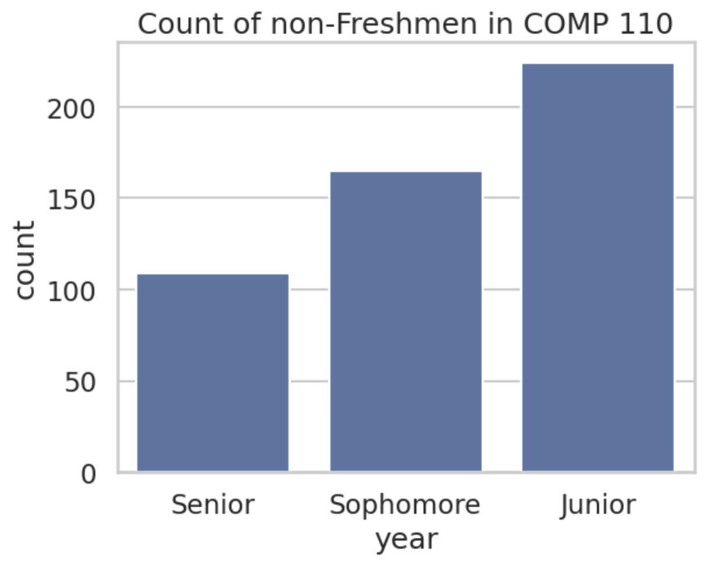
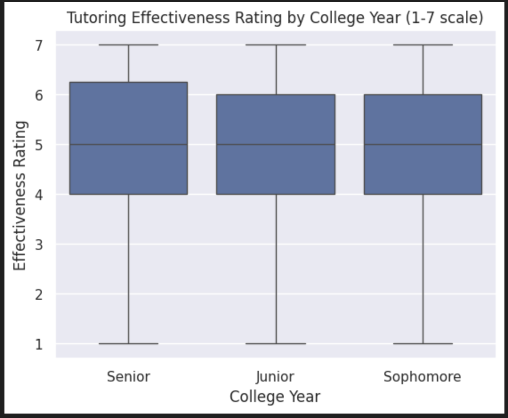

---
# Do not edit the text between these lines!
layout: default
---

# 730867923 COMP 110 Ex09

<!-- This is a comment. Below, you'll see code for inserting an image. To make this image appear, update <custom-path>. To add an image, save it inside the imgs folder of this repository. -->

## How would virtural tutoring help students?

My theory relies upon the assumption that students who live off campus (generally non-Freshmen as they don't have a first year requirement) will have a harder time going to in-person tutoring and therefore are less likely to attend despite finding it helpful.

